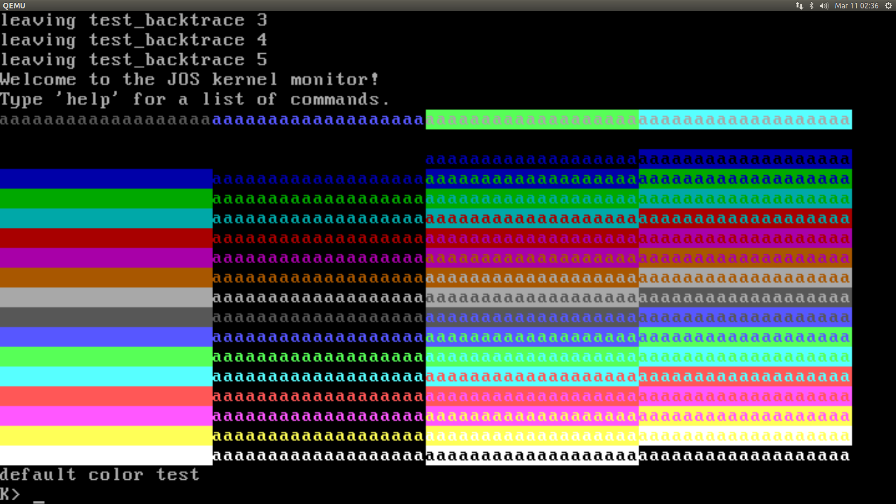

---
export_on_save:
  ebook: "html"

ebook:
  title: "JOS Lab Report"
  author: "Shuyang Cao"
  language: English
  include_toc: true
  html:
    cdn: true
---

```python {cmd=true hide=true run_on_save=true output="html" id="global"}
import time

# global variables
labnumber = 1
title = "Lab {_number} Report".format(_number=labnumber)
author = "Shuyang Cao"
createDate = "Mar 8 2018"
createTime = "23:18:00"
currentTime = time.localtime()
updateDate = time.strftime("%b %d %Y", currentTime)
updateTime = time.strftime("%H:%M:%S", currentTime)
```

```python {cmd=true hide=true run_on_save=true output="html" continue="global"}

ctStyle = 'display:inline-block;width:50%;text-align:left'
ctSpan = '<span style="{_style}">Created: {_date} {_time}</span>'
ctSpan = ctSpan.format(_style=ctStyle, _date=createDate, _time=createTime)

mtStyle = 'display:inline-block;width:50%;text-align:right'
mtSpan = '<span style="{_style}">Last Updated: {_date} {_time}</span>'
mtSpan = mtSpan.format(_style=mtStyle, _date=updateDate, _time=updateTime)

header = '<p>{_ct}{_mt}</p>'.format(_ct=ctSpan, _mt=mtSpan)


titleStyle = "font-style:italic; font-family:Times; font-size:4em"
titleH1 = '<h1 style="{_style}"><center>{_title}</center></h1>'.format(_style=titleStyle, _title=title)

authorStyle = "font-style:italic; font-family:Times; font-size:1.2em"

authorDiv = '<div style="{_style}"><center>{_author}</center><center>{_updateDate}</center></div>'.format(_style=authorStyle, _author=author, _updateDate=updateDate)

print(header)
print(titleH1)
print(authorDiv)

```

<!-- @import "[TOC]" {cmd="toc" depthFrom=1 depthTo=6 orderedList=false} -->

<!-- code_chunk_output -->

* [Development Environment](#development-environment)
	* [Environment Configuration](#environment-configuration)
	* [Set up & Test Development Environment](#set-up-test-development-environment)
* [PC Bootstrap](#pc-bootstrap)
	* [Simulating the x86](#simulating-the-x86)
	* [The PC's Physical Address Space](#the-pcs-physical-address-space)
	* [The ROM BIOS](#the-rom-bios)
	* [Exercise 2](#exercise-2)
* [The Boot Loader](#the-boot-loader)
	* [Exercise 3](#exercise-3)
	* [Loading the Kernel](#loading-the-kernel)
	* [Exercise 5](#exercise-5)
	* [Exercise 6](#exercise-6)
* [The Kernel](#the-kernel)
	* [Exercise 7](#exercise-7)
* [Formatted Printing to the Console](#formatted-printing-to-the-console)
	* [Exercise 8](#exercise-8)
	* [Challenge](#challenge)
* [The Stack](#the-stack)
	* [Exercise 9](#exercise-9)
	* [Exeercise 10](#exeercise-10)
	* [Exercise 11 & 12](#exercise-11-12)
* [Grade](#grade)

<!-- /code_chunk_output -->


## Development Environment

### Environment Configuration

* Hardware Environment
  * Host
    * Memory:&nbsp;&nbsp;&nbsp;&nbsp;&nbsp;&nbsp;&nbsp;&nbsp;&nbsp;&nbsp;&nbsp;&nbsp;&nbsp;&nbsp;&nbsp;&nbsp;&nbsp;8GB
    * Processor:&nbsp;&nbsp;&nbsp;&nbsp;&nbsp;&nbsp;&nbsp;&nbsp;&nbsp;&nbsp;&nbsp;&nbsp;&nbsp;&nbsp;Intel^®^ Core^™^ i5-4500M CPU @ 2.50GHz
    * Integrated GPU:&nbsp;&nbsp;&nbsp;&nbsp;&nbsp;Intel^®^ HD Graphics 4600
    * Discrete GPU:&nbsp;&nbsp;&nbsp;&nbsp;&nbsp;&nbsp;&nbsp;&nbsp;NVIDIA^®^ GeForce^®^ GT 755M
    * Hard Disk:&nbsp;&nbsp;&nbsp;&nbsp;&nbsp;&nbsp;&nbsp;&nbsp;&nbsp;&nbsp;&nbsp;&nbsp;&nbsp;&nbsp;1TB
    * SSD:&nbsp;&nbsp;&nbsp;&nbsp;&nbsp;&nbsp;&nbsp;&nbsp;&nbsp;&nbsp;&nbsp;&nbsp;&nbsp;&nbsp;&nbsp;&nbsp;&nbsp;&nbsp;&nbsp;&nbsp;&nbsp;&nbsp;128GB
  * Guest
    * CPU:&nbsp;&nbsp;&nbsp;&nbsp;&nbsp;&nbsp;&nbsp;&nbsp;&nbsp;&nbsp;&nbsp;&nbsp;&nbsp;&nbsp;&nbsp;&nbsp;&nbsp;&nbsp;&nbsp;&nbsp;&nbsp;&nbsp;Dual Core
    * Memory:&nbsp;&nbsp;&nbsp;&nbsp;&nbsp;&nbsp;&nbsp;&nbsp;&nbsp;&nbsp;&nbsp;&nbsp;&nbsp;&nbsp;&nbsp;&nbsp;4GB
    * Disk:&nbsp;&nbsp;&nbsp;&nbsp;&nbsp;&nbsp;&nbsp;&nbsp;&nbsp;&nbsp;&nbsp;&nbsp;&nbsp;&nbsp;&nbsp;&nbsp;&nbsp;&nbsp;&nbsp;&nbsp;&nbsp;&nbsp;30GB
* Software Environment
  * Host
    * OS:&nbsp;&nbsp;&nbsp;&nbsp;&nbsp;&nbsp;&nbsp;&nbsp;&nbsp;&nbsp;&nbsp;&nbsp;&nbsp;&nbsp;&nbsp;&nbsp;&nbsp;&nbsp;&nbsp;&nbsp;&nbsp;&nbsp;&nbsp;&nbsp;Microsoft Windows10(1709) 64-bit
    * Virtual Machine:&nbsp;&nbsp;&nbsp;&nbsp;VMware® Workstation 12 Player, 12.5.9 build-7535481
  * Guest
    * OS:&nbsp;&nbsp;&nbsp;&nbsp;&nbsp;&nbsp;&nbsp;&nbsp;&nbsp;&nbsp;&nbsp;&nbsp;&nbsp;&nbsp;&nbsp;&nbsp;&nbsp;&nbsp;&nbsp;&nbsp;&nbsp;&nbsp;&nbsp;&nbsp;Ubuntu 16.04 LTS(x86_64)
    * Kernel:&nbsp;&nbsp;&nbsp;&nbsp;&nbsp;&nbsp;&nbsp;&nbsp;&nbsp;&nbsp;&nbsp;&nbsp;&nbsp;&nbsp;&nbsp;&nbsp;&nbsp;&nbsp;&nbsp;4.13.0-36-generic
    * GCC:&nbsp;&nbsp;&nbsp;&nbsp;&nbsp;&nbsp;&nbsp;&nbsp;&nbsp;&nbsp;&nbsp;&nbsp;&nbsp;&nbsp;&nbsp;&nbsp;&nbsp;&nbsp;&nbsp;&nbsp;&nbsp;gcc 5.4.0
    * Make:&nbsp;&nbsp;&nbsp;&nbsp;&nbsp;&nbsp;&nbsp;&nbsp;&nbsp;&nbsp;&nbsp;&nbsp;&nbsp;&nbsp;&nbsp;&nbsp;&nbsp;&nbsp;&nbsp;&nbsp;GNU Make 4.1
    * GDB:&nbsp;&nbsp;&nbsp;&nbsp;&nbsp;&nbsp;&nbsp;&nbsp;&nbsp;&nbsp;&nbsp;&nbsp;&nbsp;&nbsp;&nbsp;&nbsp;&nbsp;&nbsp;&nbsp;&nbsp;&nbsp;GNU gdb 7.11.1

### Set up & Test Development Environment

```bash
$ objdump -i | grep -n -e '^elf32-i386$'  # test objdump
5:elf32-i386
$ gcc -m32 -print-libgcc-file-name        # test gcc
/usr/lib/gcc/x86_64-linux-gnu/5/32/libgcc.a
$ sudo apt-get install gcc-multilib       # Ubuntu 16.04(x86_64) needs the 32-bit support library
$ sudo apt-get install qemu               # install QEMU Emulator, ignore the patch provided on
                                          # Tools(https://pdos.csail.mit.edu/6.828/2017/tools.html)
```

## PC Bootstrap

### Simulating the x86

```bash
$:~/lab$ make
+ as kern/entry.S
+ cc kern/entrypgdir.c
+ cc kern/init.c
+ cc kern/console.c
+ cc kern/monitor.c
+ cc kern/printf.c
+ cc kern/kdebug.c
+ cc lib/printfmt.c
+ cc lib/readline.c
+ cc lib/string.c
+ ld obj/kern/kernel
+ as boot/boot.S
+ cc -Os boot/main.c
+ ld boot/boot
boot block is 390 bytes (max 510)
+ mk obj/kern/kernel.img
```

After compiling, we're ready to run [QEMU](https://www.qemu.org/ "QEMU Homepage"), supplying the file obj/kern/kernel.img, created above, as the contents of the emulated PC's "virtual hard disk." This hard disk image contains both our boot loader (obj/boot/boot) and our kernel (obj/kernel).

Now we run the QEMU like running a real PC. Below we run our initial JOS and test two commands provided by it, "*help*", "*kerninfo*".

```bash
$:~/lab$ make qemu
***
*** Use Ctrl-a x to exit qemu
***
qemu-system-i386 -nographic -drive file=obj/kern/kernel.img,index=0,media=disk,format=raw -serial mon:stdio -gdb tcp::26000 -D qemu.log
6828 decimal is XXX octal!
entering test_backtrace 5
entering test_backtrace 4
entering test_backtrace 3
entering test_backtrace 2
entering test_backtrace 1
entering test_backtrace 0
leaving test_backtrace 0
leaving test_backtrace 1
leaving test_backtrace 2
leaving test_backtrace 3
leaving test_backtrace 4
leaving test_backtrace 5
Welcome to the JOS kernel monitor!
Type 'help' for a list of commands.
K> help
help - Display this list of commands
kerninfo - Display information about the kernel
K> kerninfo
Special kernel symbols:
  _start                  0010000c (phys)
  entry  f010000c (virt)  0010000c (phys)
  etext  f0101871 (virt)  00101871 (phys)
  edata  f0112300 (virt)  00112300 (phys)
  end    f0112944 (virt)  00112944 (phys)
Kernel executable memory footprint: 75KB
K>
```

### The PC's Physical Address Space

<center>

```ditaa {cmd=true args=["-E"]}
+--------------------+ <-=-0xFFFFFFFF
| 4GB                |
|                    |
|    32 bit memory   |
|    mapped device   |
|                    |
|                    |
:                    :
|                    |
|                    |
|                    |
|                    |
|                    |
|       unused       |
+--------------------+ <-=-depends on amount of RAM
|                    |
|                    |
|  Extended Memory   |
|                    |
|                    |
+--------------------+ <-=-0x00100000 (1MB)
|      BIOS ROM      |
+--------------------+ <-=-0x000F0000 (960KB)
|    16 bit devices, |
|    expansion ROMs  |
+--------------------+ <-=-0x000C0000 (768KB)
|    VGA Display     |
+--------------------+ <-=-0x000A0000 (640KB)
|                    |
|     Low Memory     |
|                    |
+--------------------+ <-=-0x00000000
```

</center>

### The ROM BIOS

* **Waht is `BIOS` ?**

According to [wikipedia](https://en.wikipedia.org/wiki/BIOS "BIOS")

> The BIOS(Basic Input/Output System) in modern PCs initializes and tests the system hardware components, and loads a boot loader or an operating system from a mass memory device. In the era of MS-DOS, the BIOS provided a hardware abstraction layer for the keyboard, display, and other input/output (I/O) devices that standardized an interface to application programs and the operating system. More recent operating systems do not use the BIOS after loading, instead accessing the hardware components directly.

In one terminal, enter

```bash
$ make qemu-nox-gdb
```

In another terminal, enter

```bash
$ make gdb
gdb -n -x .gdbinit
GNU gdb (Ubuntu 7.11.1-0ubuntu1~16.5) 7.11.1
Copyright (C) 2016 Free Software Foundation, Inc.
License GPLv3+: GNU GPL version 3 or later <http://gnu.org/licenses/gpl.html>
This is free software: you are free to change and redistribute it.
There is NO WARRANTY, to the extent permitted by law.  Type "show copying"
and "show warranty" for details.
This GDB was configured as "x86_64-linux-gnu".
Type "show configuration" for configuration details.
For bug reporting instructions, please see:
<http://www.gnu.org/software/gdb/bugs/>.
Find the GDB manual and other documentation resources online at:
<http://www.gnu.org/software/gdb/documentation/>.
For help, type "help".
Type "apropos word" to search for commands related to "word".
+ target remote localhost:26000
warning: A handler for the OS ABI "GNU/Linux" is not built into this configuration
of GDB.  Attempting to continue with the default i8086 settings.

The target architecture is assumed to be i8086
[f000:fff0]    0xffff0:    ljmp   $0xf000,$0xe05b
0x0000fff0 in ?? ()
+ symbol-file obj/kern/kernel
(gdb)
```

From GDB output, we konw `ljmp   $0xf000,$0xe05b` is the first intructions to be executed. Here we can conclude a few things about what happened after power up.

* The IBM PC starts executing at physical address 0x000ffff0, which is at the very top of the 64KB area reserved for the ROM BIOS.
* The PC starts executing with CS = 0xf000 and IP = 0xfff0.
* The first instruction to be executed is a jmp instruction, which jumps to the segmented address CS = 0xf000 and IP = 0xe05b.

Up unitl now, our PC still runs in the `real mode`. Memory address is translated as below.

```plain
  physical address = 16 * segment + offset
```

Since 16-bit mode can only access 1MB memory. Different combinations of segment and offset will be translated into the same physical address.

* *What BIOS does*
  * check hardware status
  * set up an interrupt descriptor table
  * initialize various devices such as the VGA display
  * search for a bootable device such as a floppy, hard drive, or CD-ROM
  * load `boot loader` into memory from a bootable device and tranfer control to it.

### Exercise 2

> Q: Use GDB's `si` (Step Instruction) command to trace into the ROM BIOS for a few more instructions, and try to guess what it might be doing.

Using `tee` we can dump GDB output to files. After filtering out GDB prompts, we get the first few lines of BIOS assembly code as shown below.

```assembly {.line-numbers}
[f000:fff0]    0xffff0:    ljmp   $0xf000,$0xe05b     ; Jump from the top of the reserved area to the beginning of BIOS program
[f000:e05b]    0xfe05b:     cmpl   $0x0,%cs:0x6c48    ; Whether the dword stored in %cs:0x6c48, i.e. 0xf6c48, is zero.
                                                      ; Maybe this is a sanity check but I'm not sure.
[f000:e062]    0xfe062:    jne    0xfd2e1         ; Conditional jump.
                                                  ; According to next instruction, the result of last instruction is equality.
[f000:e066]    0xfe066:    xor    %dx,%dx         ; Initialize %dx to zero.
[f000:e068]    0xfe068:    mov    %dx,%ss         ; Initialize stack segment register to zero.
[f000:e06a]    0xfe06a:    mov    $0x7000,%esp    ; Initialize stack pointer register to $0x7000. But why 0x7000 is chosen remains unknown.
[f000:e070]    0xfe070:    mov    $0xf3691,%edx   ;
[f000:e076]    0xfe076:    jmp    0xfd165         ; Unconditional jump. Taking several instructions before and after this instruction, it looks like BIOS is calling a C function from assembly code.
                                                  ; For example, BIOS has initialized its data stack, stored an argument in %edx
[f000:d165]    0xfd165:    mov    %eax,%ecx        ; Don't  know where %eax is intialized.
[f000:d168]    0xfd168:    cli                     ; Disable interrupt
[f000:d169]    0xfd169:    cld                     ; Clear direction flag,
[f000:d16a]    0xfd16a:    mov    $0x8f,%eax
[f000:d170]    0xfd170:    out    %al,$0x70        ;
[f000:d172]    0xfd172:    in     $0x71,%al
[f000:d174]    0xfd174:    in     $0x92,%al
[f000:d176]    0xfd176:    or     $0x2,%al
[f000:d178]    0xfd178:    out    %al,$0x92
[f000:d17a]    0xfd17a:    lidtw  %cs:0x6c38
[f000:d180]    0xfd180:    lgdtw  %cs:0x6bf4
[f000:d186]    0xfd186:    mov    %cr0,%eax
[f000:d189]    0xfd189:    or     $0x1,%eax
[f000:d18d]    0xfd18d:    mov    %eax,%cr0
[f000:d190]    0xfd190:    ljmpl  $0x8,$0xfd198
The target architecture is assumed to be i386
=> 0xfd198:   mov    $0x10,%eax
=> 0xfd19d:   mov    %eax,%ds
=> 0xfd19f:   mov    %eax,%es
=> 0xfd1a1:   mov    %eax,%ss
=> 0xfd1a3:   mov    %eax,%fs
=> 0xfd1a5:   mov    %eax,%gs
=> 0xfd1a7:   mov    %ecx,%eax
=> 0xfd1a9:   jmp    *%edx
=> 0xf3691:   push   %ebx
=> 0xf3692:   sub    $0x20,%esp
...
```

## The Boot Loader

* **What is `boot loader` ?**

according to [wikipedia](https://en.wikipedia.org/wiki/Booting)
>A boot loader is a computer program that loads an operating system or some other system software for the computer after completion of the power-on self-tests; it is the loader for the operating system itself. Within the hard reboot process, it runs after completion of the self-tests, then loads and runs the software.

Floppy and hard disks for PCs are divided into 512 byte regions called ***sectors***. A sector is the disk's minimum transfer granularity: each read or write operation must be one or more sectors in size and aligned on a sector boundary. The virtual disk provided by our QEMU simulates the same mechanism.

If the disk is bootable, the first sector is called the ***boot sector***, since this is where the boot loader code resides. When the BIOS finds a bootable floppy or hard disk, it loads the 512-byte boot sector into memory at physical addresses 0x7c00 through 0x7dff, and then uses a `jmp` instruction to set the CS:IP to 0000:7c00, passing control to the boot loader. Like the BIOS load address, these addresses are fairly arbitrary - but they are fixed and standardized for PCs.

* **Why 0x7c00 ?**

  The magic number 0x7c00 has its interesting history. You can refer to [here](https://www.glamenv-septzen.net/en/view/6) .

* **What boot loader does ?**
  * switch the processor from ***real mode*** to ***32-bit protected mode***
  * read the kernel from the hard disk by directly accessing the IDE disk device registers via the x86's special I/O instructions.
  * transfer control to kernel

* **What is 32-bit Protected Mode ?**
  * **Real Mode**
  In real mode, address range from 0x00000 to 0xFFFFF. These addresses require a 20-bit number. Obviously, a 20-bit number will not fit into any of the 8086’s 16-bit registers. Intel solved this problem, by using two 16-bit values determine an address. The first 16-bit value is called the selector. Selector values must be stored in segment registers. The second 16-bit value is called the offset. The physical address referenced by a 32-bit selector:offset pair iscomputed by the formula:
  *<center>16 * selector + offset</center>*
  * **16-bit protected mode**
  In the 80286’s 16-bit protected mode, selector values are interpreted completely differently than in real mode. In real mode, a selector value is a paragraph number of physical memory. In protected mode, a selector value is an index into a descriptor table.
  In protected mode, the segments are not at fixed positions in physical memory. In fact, they do not have to be in memory at all.
  * **32-bit protected mode**
  The 80386 introduced 32-bit protected mode. There are two major differences between 386 32-bit and 286 16-bit protected modes:
    1. Offsets are expanded to be 32-bits. This allows an offset to range up to 4 billion. Thus, segments can have sizes up to 4 gigabytes.
    2. Segments can be divided into smaller 4K-sized units called ***pages***. The virtual memory system works with pages now instead of segments.
* **Why Protected Mode ?**
  * Protected mode uses a technique called ***virtual memory***. The basic idea of a virtual memory system is to only keep the data and code in memory that programs are currently using. Other data and code are stored temporarily on disk until they are needed again.
  * Segments/pages are moved between memory and disk as needed. When a segment/page is returned to memory from disk, it is very likely that it will be put into a different area of memory that it was in before being moved to disk. All of this is done *transparently* by the operating system. The program does not have to be written differently for virtual memory to work.

  The paragraphs are quoted from sections 1.2.6, 1.2.7 and 1.2.8 [PC Assembly Language](https://pdos.csail.mit.edu/6.828/2014/readings/pcasm-book.pdf), Or you may refer to Intel architecture manuals.

### Exercise 3

> Q 1: At what point does the processor start executing 32-bit code? What exactly causes the switch from 16- to 32-bit mode?

```assembly {.line-numbers}
  ...
  lgdt    gdtdesc                     # Load Global Descriptor Table Register
  movl    %cr0, %eax                  # These three instructions, toggle on CR0 PE bit, switch on Protected mode. After these intructions is executed, CPU begins to decode instruction in 32-bit mode.
  orl     $CR0_PE_ON, %eax
  movl    %eax, %cr0
  ljmp    $PROT_MODE_CSEG, $protcseg  # Jump to next instruction, but in 32-bit code segment.
                                      # Switches processor into 32-bit mode.
                                      # The reason why there is such a peculiar jump is because of the pipeline design in modern CPU
                                      # Even though CPU starts to decode instructions in 32-bit mode, CPU has already prefetched instructions and decode them in 16-bit mode, which should be decoded in 32-bit. So we need a long jump to force CPU to flush its pipeline and re-decode next instruction properly.

  .code32                             # Assemble for 32-bit mode
protcseg:
  movw    $PROT_MODE_DSEG, %ax        # Our data segment selector
  ...
```

> Q 2: What is the last instruction of the boot loader executed, and what is the first instruction of the kernel it just loaded?

  The last instruction of the boot loader executed:
  In `main.c`, it's
  ```c
  ((void (*)(void)) (ELFHDR->e_entry))();
  ```

  in `obj/boot/boot.asm`, it's

  ```assembly
  7d6b:  call   *0x10018
  ```

  The first instruction of the kernel it just loaded:
  In `entry.S`, it's
  ```assembly
  movw    $0x1234,0x472           # warm boot
  ```

  In `obj/kern/kernel.asm`, it's
  ```assembly
  f010000c:   movw   $0x1234,0x472
  ```

> Q 3: Where is the first instruction of the kernel?

From the disassembly code at `obj/kern/kernel.asm`, `0x10000c: movw   $0x1234,0x472`, we know the first instruction of the kernel resides at 0x10000c;

Based on the last instruction of the boot loader, `call   *0x10018`, we can check the content(32-bit) at 0x10018 to confirm the address of the first instruction of the kernel. The result agrees with the disassembly code.

> Q 4: How does the boot loader decide how many sectors it must read in order to fetch the entire kernel from disk? Where does it find this information?

ELF Header is read fisrt. Then `((uint8_t *) ELFHDR + ELFHDR->e_phoff)` gives the beginning of program header table and `ELFHDR->e_phnum` indicates how many program segments there are to be read.

The structure of ***ELF*** file is shown below.

<center>

```ditaa {cmd=true args=[]}
              +----------------------+
              |                      |
              |     ELF Header       |
              |                      |
              +----------------------+
/----------=--|                      |
|   /-----=---| Program header table |
|   |         |                      |
|   |         +----------------------+
|   |         |                      |
|   |         |                      |
|   |     /-=-|        .text         |<-----------\
|   |     |   |                      |            |
|   |     |   |                      |            |
|   \---->+   +----------------------+            |
|         |   |                      |            |
|         |   |                      |            |
|         \---|       .rodata        |<-------\   |
|             |                      |        |   |
|         /-=-|                      |        |   |
|         |   +----------------------+        |   |
|         |                                   |   |
|         |             . . .                 |   |
\-------->+                                   |   |
          |   +----------------------+        |   |
          |   |                      |        |   |
          |   |                      |        |   |
          \-=-|        .data         |<---\   |   |
              |                      |    |   |   |
              |                      |    |   |   |
              +----------------------+    |   |   |
              |                      |-=--/   |   |
              | Section header table |-=------/   |
              |                      |-=----------/
              +----------------------+
```

</center>

### Loading the Kernel

***Kernel is essentially a normal executable program。***
> **link address(VMA)**
The link address of a section is the memory address from which the section expects to execute.
> **load address(LMA)**
The load address of a section is the memory address at which that section should be loaded into memory.

* program header table of `obj/boot/boot.out`
  The load address is `paddr`, i.e., 0x00007c00. And the link address is `vaddr`, i.e., 0x00007c00, too.

```bash
$ objdump -x obj/boot/boot.out
obj/boot/boot.out:     file format elf32-i386
obj/boot/boot.out
architecture: i386, flags 0x00000012:
EXEC_P, HAS_SYMS
start address 0x00007c00

Program Header:
    LOAD off    0x00000074 vaddr 0x00007c00 paddr 0x00007c00 align 2**2
         filesz 0x00000230 memsz 0x00000230 flags rwx
   STACK off    0x00000000 vaddr 0x00000000 paddr 0x00000000 align 2**4
         filesz 0x00000000 memsz 0x00000000 flags rwx
```

* program header table of `obj/kern/kernel`
  The load address is `paddr`, i.e., 0x00100000. The link address is `vaddr`, i.e. 0xf0100000.

```bash
$ objdump -x obj/kern/kernel
obj/kern/kernel:     file format elf32-i386
obj/kern/kernel
architecture: i386, flags 0x00000112:
EXEC_P, HAS_SYMS, D_PAGED
start address 0x0010000c

Program Header:
    LOAD off    0x00001000 vaddr 0xf0100000 paddr 0x00100000 align 2**12
         filesz 0x00007120 memsz 0x00007120 flags r-x
    LOAD off    0x00009000 vaddr 0xf0108000 paddr 0x00108000 align 2**12
         filesz 0x0000a300 memsz 0x0000a944 flags rw-
   STACK off    0x00000000 vaddr 0x00000000 paddr 0x00000000 align 2**4
         filesz 0x00000000 memsz 0x00000000 flags rwx
```

The load address and the link address are the same for bootloader. But it's not true for kernel. How this works is eplained [here](#the-kernel).

### Exercise 5

> Q:  Trace through the first few instructions of the boot loader again and identify the first instruction that would "break" or otherwise do the wrong thing if you were to get the boot loader's link address wrong. Then change the link address in boot/Makefrag to something wrong, run make clean, recompile the lab with make, and trace into the boot loader again to see what happens. Don't forget to change the link address back and make clean again afterward!

We changed the boot loader's link address in `boot/Makefrag` from 0x7c00 to 0x8c00 and recompile the lab. Below in the new `boot/boot.asm`. As we can see, the new bootloader was compiled to execute from 0x8c00. But 0x7c00 is hardcoded into BIOS. Thus BIOS still loaded bootloader into memory starting from 0x7c00. The first several instructions that are not related to memory address still worked fine. The fisrt instruction that did the wrong thing was `lgdt gdtdesc` as it would load the  Global Descriptor Table to a wrong place. However, the program didn't broke up until now. The instruction that killed the bootloader was the long jump, `ljmp $0x8,$0x8c32`. From bootloader's perspective, it started at 0x8c00 so 0x8c32 was the right place to jump to. But BIOS loaded bootloader into 0x7C00, which meant the target code didn't reside at 0x8C32 at all. After `ljmp $0x8,$0x8c32`, BIOS took control and executed from `[f000:e05b] 0xfe05b: cmpl $0x0 %cs:0x6c48`.

```assembly {.line-numbers}
...

start:
  .code16                     # Assemble for 16-bit mode
  cli                         # Disable interrupts
    8c00: fa                    cli
...

  lgdt    gdtdesc
    8c1e: 0f 01 16              lgdtl  (%esi)
    8c21: 64 8c 0f              mov    %cs,%fs:(%edi)
  movl    %cr0, %eax
    8c24: 20 c0                 and    %al,%al
  orl     $CR0_PE_ON, %eax
    8c26: 66 83 c8 01           or     $0x1,%ax
  movl    %eax, %cr0
    8c2a: 0f 22 c0              mov    %eax,%cr0

  # Jump to next instruction, but in 32-bit code segment.
  # Switches processor into 32-bit mode.
  ljmp    $PROT_MODE_CSEG, $protcseg
    8c2d: ea                    .byte 0xea
    8c2e: 32                    .byte 0x32
    8c2f: 8c 08                 mov    %cs,(%eax)
 ...

00008c32 <protcseg>:

  .code32                     # Assemble for 32-bit mode
protcseg:
  # Set up the protected-mode data segment registers
  movw    $PROT_MODE_DSEG, %ax    # Our data segment selector
    8c32: 66 b8 10 00              mov    $0x10,%ax

  ...
```

### Exercise 6

> Q: Examine the 8 words of memory at 0x00100000 at the point the BIOS enters the boot loader, and then again at the point the boot loader enters the kernel. Why are they different? What is there at the second breakpoint?

On entering bootloader, the 8 words of memory at 0x00100000 are all zero. I think it's because of the initialization during memory power on.

```plain
(gdb) x/8x 0x100000
0x100000: 0x00000000    0x00000000    0x00000000    0x00000000
0x100010: 0x00000000    0x00000000    0x00000000    0x00000000
```

On entering kernel, the 8 words of memory at 0x00100000 are

```plain
(gdb) x/8x 0x100000
0x100000: 0x1badb002    0x00000000    0xe4524ffe    0x7205c766
0x100010: 0x34000004    0x0000b812    0x220f0011    0xc0200fd8
```

They are kernel code. The address 0x00100000 comes from *field* __p_vaddr__, the first __Program Header__.

## The Kernel

* **How the link address 0xf0100000 works ?**
  Let us make this question more clear. We never load our kernel into 0xf0100000 and our simulated PC even doesn't has enough memory for 0xf0100000. How can our kernel start to execute from such a high address, 0xf0100000? The answer is

  1. It's a convention. OS kernels often like to be linked and run at very high virtual address, such as 0xf0100000, in order to leave the lower part of the processor's virtual address space for user programs to use. Yet many machines don't have any physical memory at address 0xf0100000, so we can't count on being able to store the kernel there.
  2. We will use the processor's memory management hardware to map virtual address 0xf0100000 (the link address at which the kernel code expects to run) to physical address 0x00100000 (where the boot loader loaded the kernel into physical memory). This way, although the kernel's virtual address is high enough to leave plenty of address space for user processes, it will be loaded in physical memory at the 1MB point in the PC's RAM, just above the BIOS ROM. This approach requires that the PC have at least a few megabytes of physical memory (so that physical address 0x00100000 works), but this is likely to be true of any PC built after about 1990.
  3. Now we give a more detialed description about the frist few instructions of JOS kernel. At first, the paging is off, which is why the first few instructions are able to execute from 0x00100000. Then the paging is turned on. We should emphasize that both the range 0xf0000000 through 0xf0400000 and the range 0x00000000 through 0x00400000 are mapped to physical addresses 0x00000000 through 0x00400000, which is why our kernel is still able to execute in the range 0x00000000 through 0x00400000, i.e., these two instructions, `mov $relocated, %eax`, `jmp *%eax`. After `jmp *%eax`, our kernel is running in high memory addresses.

### Exercise 7

> Q: Use QEMU and GDB to trace into the JOS kernel and stop at the movl %eax, %cr0. Examine memory at 0x00100000 and at 0xf0100000. Now, single step over that instruction using the stepi GDB command. Again, examine memory at 0x00100000 and at 0xf0100000.

```bash
(gdb) x/10i 0x10000c                         # What resides at 0x0x10000c
   0x10000c:  movw   $0x1234,0x472
   0x100015:  mov    $0x110000,%eax
   0x10001a:  mov    %eax,%cr3
   0x10001d:  mov    %cr0,%eax
   0x100020:  or     $0x80010001,%eax
   0x100025:  mov    %eax,%cr0
   0x100028:  mov    $0xf010002f,%eax
   0x10002d:  jmp    *%eax
   0x10002f:  mov    $0x0,%ebp
   0x100034:  mov    $0xf0110000,%esp
(gdb) x/10i 0xf010000c                       # What resides at 0xf010000c, "add %al,(%eax)" means contents there are all zero.
   0xf010000c <entry>: add    %al,(%eax)
   0xf010000e <entry+2>: add    %al,(%eax)
   0xf0100010 <entry+4>: add    %al,(%eax)
   0xf0100012 <entry+6>: add    %al,(%eax)
   0xf0100014 <entry+8>: add    %al,(%eax)
   0xf0100016 <entry+10>: add    %al,(%eax)
   0xf0100018 <entry+12>: add    %al,(%eax)
   0xf010001a <entry+14>: add    %al,(%eax)
   0xf010001c <entry+16>: add    %al,(%eax)
   0xf010001e <entry+18>: add    %al,(%eax)
(gdb) stepi 7                               # Right after "mov    %eax,%cr0" is executed
=> 0x100028:  mov    $0xf010002f,%eax
(gdb) x/10i 0x10000c                        # Memory at 0x10000c doesn't change.
   0x10000c:  movw   $0x1234,0x472
   0x100015:  mov    $0x110000,%eax
   0x10001a:  mov    %eax,%cr3
   0x10001d:  mov    %cr0,%eax
   0x100020:  or     $0x80010001,%eax
   0x100025:  mov    %eax,%cr0
=> 0x100028:  mov    $0xf010002f,%eax
   0x10002d:  jmp    *%eax
   0x10002f:  mov    $0x0,%ebp
   0x100034:  mov    $0xf0110000,%esp
(gdb) x/10i 0xf010000c                      # 0xf010000c is now mapped to 0x0010000c
   0xf010000c <entry>:  movw   $0x1234,0x472
   0xf0100015 <entry+9>:  mov    $0x110000,%eax
   0xf010001a <entry+14>: mov    %eax,%cr3
   0xf010001d <entry+17>: mov    %cr0,%eax
   0xf0100020 <entry+20>: or     $0x80010001,%eax
   0xf0100025 <entry+25>: mov    %eax,%cr0
   0xf0100028 <entry+28>: mov    $0xf010002f,%eax
   0xf010002d <entry+33>: jmp    *%eax
   0xf010002f <relocated>:  mov    $0x0,%ebp
   0xf0100034 <relocated+5>:  mov    $0xf0110000,%esp
```

> Q: What is the first instruction after the new mapping is established that would fail to work properly if the mapping weren't in place?

Were the new mapping not established, “jmp *%eax” would fail and the simulator would crash.

## Formatted Printing to the Console

* **How printf works**
  To understand how `printf` works, we need to know the mechanism behind [Variadic Function in C](http://en.cppreference.com/w/cpp/utility/variadic).

### Exercise 8

>Q: We have omitted a small fragment of code - the code necessary to print octal numbers using patterns of the form "%o". Find and fill in this code fragment.

```git
$ git diff | cat
diff --git a/lib/printfmt.c b/lib/printfmt.c
index 28e01c9..72dad76 100644
--- a/lib/printfmt.c
+++ b/lib/printfmt.c
@@ -206,10 +206,9 @@ vprintfmt(void (*putch)(int, void*), void *putdat, const char *fmt, va_list ap)
                // (unsigned) octal
                case 'o':
                        // Replace this with your code.
-                       putch('X', putdat);
-                       putch('X', putdat);
-                       putch('X', putdat);
-                       break;
+                       num = getuint(&ap, lflag); // putch('X', putdat);
+                       base = 8; //putch('X', putdat);
+                       goto number; //putch('X', putdat);

                // pointer
                case 'p':
```

> Q: Explain the interface between printf.c and console.c. Specifically, what function does console.c export? How is this function used by printf.c?

"console.c" exports `void cputchar(int)`, `int getchar(void)` and `int iscons(int fdnum)`. In "printf.c", `static void putch(int, int *)` wraps `void cputchar(int)` and is passed by `int vcprintf(const char *, va_list)` to `void vprintfmt(void (*)(int, void*), void *, const char *, va_list)` as the first argument.

> Q: Explain the following from console.c:

```c {.line-numbers}
if (crt_pos >= CRT_SIZE) {
    int i;
    memmove(crt_buf, crt_buf + CRT_COLS, (CRT_SIZE - CRT_COLS) * sizeof(uint16_t));
    for (i = CRT_SIZE - CRT_COLS; i < CRT_SIZE; i++)
        crt_buf[i] = 0x0700 | ' ';
        crt_pos -= CRT_COLS;
}
```

Scroll up one line automatically when the screen is full.

> Q: Trace the execution of the following code step-by-step:
> ```c {.line-numbers}
> int x = 1, y = 3, z = 4;
> cprintf("x %d, y %x, z %d\n", x, y, z);
> ```
> + In the call to cprintf(), to what does fmt point? To what does ap point?
> + List (in order of execution) each call to cons_putc, va_arg, and vcprintf. For cons_putc, list its argument as well. For va_arg, list what ap points to before and after the call. For vcprintf list the values of its two arguments.

In the call to `cprintf()`, *fmt* point to the format string of its arguments. In this case, *fmt* should point to some place in *.rodata* because ""x %d, y %x, z %d\n" is a const string and will be compiled into program. *ap* points to arguments after fmt. Those arguments should reside on stack.

> Q: Run the following code.
> ```c {.line-numbers}
> unsigned int i = 0x00646c72;
> cprintf("H%x Wo%s", 57616, &i);
> ```
> What is the output? Explain how this output is arrived at in the step-by-step manner.

1. 'H' is output. The String is "H".
2. "%x" means displaying the argument in the manner of hexadecimal integer (lower case). Here it means outputing 57616 as E110. The String is "HE110".
3. "\_Wo" is output. The String is "HE110_Wo".('_' indicaes one whitespace here).
4. "%s" means interpreting the arguments as a pointer to a string. Here the argument is actually a pointer to an *unsigned int* 0x00646c72. We should keep in mind that intel^®^ 80386 is a little-endian CPU that 0x00646c72 is stored as "72 6c 64 00". Interpreted as a series of characters, it should be 'r', 'l', 'd', '\0'. '\0' means the end of a string. So "rld" is output.
5. Finally, "HE110 World" is output.

> Q: The output depends on that fact that the x86 is little-endian. If the x86 were instead big-endian what would you set i to in order to yield the same output? Would you need to change 57616 to a different value?

On a big-endian CPU, `57616` doesn't need to change. `0x00646c72` should be changed to `0x726c6400`.

> Q: In the following code, what is going to be printed after 'y='? (note: the answer is not a specific value.) Why does this happen?
> ```c
> cprintf("x=%d y=%d", 3);
> ```
Any decimal number might be printed after 'y='. The implementation of variadic functions is strongly dependent the platform and the calling convention. The behavior when __va_list__ points to some place out of the stack where arguments locates is undefined and may vary from platform to platform, from compiler to compiler.

> Q. Let's say that GCC changed its calling convention so that it pushed arguments on the stack in declaration order, so that the last argument is pushed last. How would you have to change cprintf or its interface so that it would still be possible to pass it a variable number of arguments?

Push an integer after the last argument indicating the number of arguments. This procedure can be provided by  *Variadic Function* mechanism and remain transparent to programmers.

### Challenge

> Enhance the console to allow text to be printed in different colors. If you're feeling really adventurous, you could try switching the VGA hardware into a graphics mode and making the console draw text onto the graphical frame buffer.

A specifier "%m" is provide for setting text color. A global varaible `__textcolor` is defined for storing text color attribute. Text color set in one `cprintf` call is expired after the `cprintf` call is finished and reset to default setting. Some macros are defined in `inc/color.h` for convenience.

The method for displaying colored text is using the 8-bit attribute part in each character in cga buffer. Actually, in cga buffer, each character is stored using 16 bit. The structure is shown below.

<center>

```ditaa {cmd=true args=["-E"]}
  +-----------------------------------------------+-----------------------------------------------+
  |                   Attribute                   |                   Character                   |
  +-----+-----+-----+-----+-----+-----+-----+-----+-----+-----+-----+-----+-----+-----+-----+-----+
  |  7  |  6  |  5  |  4  |  3  |  2  |  1  |  0  |  7  |  6  |  5  |  4  |  3  |  2  |  1  |  0  |
  +-----+-----+-----+-----+-----+-----+-----+-----+-----+-----+-----+-----+-----+-----+-----+-----+
  |    Background color   |    Foreground color   |                  Code point                   |
  +-----------------------+-----------------------+-----------------------------------------------+
```

</center>

To test my implementation, I added the following code in `monitor.c/monitor` :

```c {.line-numbers}
  char *ph = "aaaaaaaaaaaaaaaaaaa";
  char *wph = "                   ";
  cprintf("%m%s%m%s%m%s%m%s\n\n", FORE_GROUND(TEXT_GRAY), ph, FORE_GROUND(TEXT_BLUE), ph, BACK_GROUND(TEXT_GREEN), ph, BACK_GROUND(TEXT_CYAN), ph);
  for (int i = 0; i < 16; ++i) {
    cprintf("%m%s", BACK_GROUND(i), wph);
    cprintf("%m%s", FORE_GROUND(i), ph);
    cprintf("%m%s", TEXT_COLOR(i+1, i), ph);
    cprintf("%m%s\n", TEXT_COLOR(i, i+1), ph);
  }
  cprintf("%s\n", "default color test");
```

The test result is shown in the following image.



The code for colored text is list in the following `git diff` log.

```git
diff --git a/inc/color.h b/inc/color.h
new file mode 100644
index 0000000..4857652
--- /dev/null
+++ b/inc/color.h
@@ -0,0 +1,61 @@
+#ifndef JOS_INC_COLOR_H
+#define JOS_INC_COLOR_H
+
+
+/*
+ * To control text color, each 8-bit are prefixed with another 8-bit attribute. If the character is
+ * sent to a CGA device, all 16 bits are written into the crt buffer and a colored character is displayed.
+ * If the character is sent to a serial port or a lpt port, the 16 bits is truncated to 8 bits. Only
+ * 8-bit character part is sent.
+ *
+ * +-----------------------------------------------+-----------------------------------------------+
+ * |                   Attribute                   |                  Character                    |
+ * +-----------------------------------------------+-----------------------------------------------+
+ * |  7  |  6  |  5  |  4  |  3  |  2  |  1  |  0  |  7  |  6  |  5  |  4  |  3  |  2  |  1  |  0  |
+ * +-----------------------+-----------------------+-----------------------------------------------+
+ * |    Background color   |    Foreground color   |                  Code point                   |
+ * +-----------------------+-----------------------+-----------------------------------------------+
+ *
+ *
+ * reference:
+ * 1. http://blog.csdn.net/scnu20142005027/article/details/51264186
+ * 2. https://en.wikipedia.org/wiki/VGA-compatible_text_mode#Text_buffer
+ * 3. https://en.wikipedia.org/wiki/ANSI_escape_code#8-bit
+ * 4. http://ascii-table.com/ansi-escape-sequences.php
+ * 5. http://rrbrandt.dee.ufcg.edu.br/en/docs/ansi/
+ */
+
+
+extern int __textcolor;                     // global variable for text color attribute
+
+#define BACK_SHIFT                          12
+#define FORE_SHIFT                          8
+#define BACK_GROUND(_COLOR_)                ( ((_COLOR_) << BACK_SHIFT) | (TEXT_SILVER << FORE_SHIFT))
+#define FORE_GROUND(_COLOR_)                ( (_COLOR_) << FORE_SHIFT )
+#define TEXT_COLOR(_FORE_, _BACK_)          ( ((_FORE_) << FORE_SHIFT) | ((_BACK_) << BACK_SHIFT) )
+#define SET_TEXT_COLOR(_color_)             ( __textcolor = _color_ )
+#define RESET_TEXT_COLOR()                  ( __textcolor = TEXT_DF_COLOR )
+#define SET_CHAR_COLOR(_char_, _color_)     ( _char_ |= (~0xff & _color_) )
+
+
+#define TEXT_BLACK              0x00        // black foreground color, RGB: #000000
+#define TEXT_NAVY_BLUE          0x01        // navy blue foreground color, RGB: #000080
+#define TEXT_OFFICE_GREEN       0x02        // office green foreground color, RGB: #008000
+#define TEXT_TEAL               0x03        // teal foreground color, RGB: #008080
+#define TEXT_MAROON             0x04        // maroon foreground color, RGB: #800000
+#define TEXT_PURPLE             0x05        // purple foreground color, RGB: #800080
+#define TEXT_OLIVE              0x06        // olive foreground color, RGB: #808000
+#define TEXT_SILVER             0x07        // sliver foreground, RGB: #808000
+#define TEXT_GRAY               0x08        // gray foreground color, RGB: #808000
+#define TEXT_BLUE               0x09        // blue foreground color, RGB: #0000ff
+#define TEXT_GREEN              0x0a        // green foreground color, RGB: #00ff00
+#define TEXT_CYAN               0x0b        // cyan foreground color, RGB: #00ffff
+#define TEXT_RED                0x0c        // red foregound color, RGB: #ff0000
+#define TEXT_MAGENTA            0x0d        // magenta foreground color, RGB: #ff00ff
+#define TEXT_YELLOW             0x0e        // yellow foreground color, RGB: #ffff00
+#define TEXT_WHITE              0x0f        // white foreground color, RGB: #ffffff
+
+#define TEXT_DF_COLOR           TEXT_COLOR(TEXT_SILVER, TEXT_BLACK)   // defualt text color
+
+
+#endif /* !JOS_INC_COLOR_H */
\ No newline at end of file
diff --git a/kern/Makefrag b/kern/Makefrag
index 3b2982e..8ff9a6e 100644
--- a/kern/Makefrag
+++ b/kern/Makefrag
@@ -28,6 +28,7 @@ KERN_SRCFILES :=    kern/entry.S \
      kern/sched.c \
      kern/syscall.c \
      kern/kdebug.c \
+     lib/color.c \
      lib/printfmt.c \
      lib/readline.c \
      lib/string.c
diff --git a/kern/console.c b/kern/console.c
index e125b39..fdd4516 100644
--- a/kern/console.c
+++ b/kern/console.c
@@ -5,7 +5,7 @@
 #include <inc/kbdreg.h>
 #include <inc/string.h>
 #include <inc/assert.h>
-
+#include <inc/color.h>
 #include <kern/console.h>

 static void cons_intr(int (*proc)(void));
@@ -173,7 +173,7 @@ cga_putc(int c)

     // if no attribute given, then use black on white
     if (!(c & ~0xFF))
-        c |= 0x0700;
+        SET_CHAR_COLOR(c, __textcolor);

     switch (c & 0xff) {
     case '\b':
diff --git a/kern/monitor.c b/kern/monitor.c
index 5f9275c..1f96df0 100644
--- a/kern/monitor.c
+++ b/kern/monitor.c
@@ -6,6 +6,7 @@
 #include <inc/memlayout.h>
 #include <inc/assert.h>
 #include <inc/x86.h>
+#include <inc/color.h>

 #include <kern/console.h>
 #include <kern/monitor.h>
@@ -155,6 +156,16 @@ monitor(struct Trapframe *tf)
     cprintf("Welcome to the JOS kernel monitor!\n");
     cprintf("Type 'help' for a list of commands.\n");

+    char *ph = "aaaaaaaaaaaaaaaaaaa";
+    char *wph = "                   ";
+    cprintf("%m%s%m%s%m%s%m%s\n\n", FORE_GROUND(TEXT_GRAY), ph, FORE_GROUND(TEXT_BLUE), ph, BACK_GROUND(TEXT_GREEN), ph, BACK_GROUND(TEXT_CYAN), ph);
+    for (int i = 0; i < 16; ++i) {
+        cprintf("%m%s", BACK_GROUND(i), wph);
+        cprintf("%m%s", FORE_GROUND(i), ph);
+        cprintf("%m%s", TEXT_COLOR(i+1, i), ph);
+        cprintf("%m%s\n", TEXT_COLOR(i, i+1), ph);
+    }
+    cprintf("%s\n", "default color test");

     while (1) {
         buf = readline("K> ");
diff --git a/lib/color.c b/lib/color.c
new file mode 100644
index 0000000..80b29d5
--- /dev/null
+++ b/lib/color.c
@@ -0,0 +1,3 @@
+#include <inc/color.h>
+
+int __textcolor = TEXT_DF_COLOR;
\ No newline at end of file
diff --git a/lib/printfmt.c b/lib/printfmt.c
index caadf07..3e0b986 100644
--- a/lib/printfmt.c
+++ b/lib/printfmt.c
@@ -7,6 +7,7 @@
 #include <inc/string.h>
 #include <inc/stdarg.h>
 #include <inc/error.h>
+#include <inc/color.h>

 /*
  * Space or zero padding and a field width are supported for the numeric
@@ -90,8 +91,10 @@ vprintfmt(void (*putch)(int, void*), void *putdat, const char *fmt, va_list ap)

     while (1) {
         while ((ch = *(unsigned char *) fmt++) != '%') {
-            if (ch == '\0')
+            if (ch == '\0') {
+                RESET_TEXT_COLOR();        // reset textcolor after string is output
                 return;
+            }
             putch(ch, putdat);
         }

@@ -170,6 +173,11 @@ vprintfmt(void (*putch)(int, void*), void *putdat, const char *fmt, va_list ap)
             else
                 printfmt(putch, putdat, "%s", p);
             break;
+
+        // change text color
+        case 'm':
+            SET_TEXT_COLOR(getint(&ap, lflag));
+            break;

         // string
         case 's':
```

## The Stack

### Exercise 9

> Q :  Determine where the kernel initializes its stack, and exactly where in memory its stack is located. How does the kernel reserve space for its stack? And at which "end" of this reserved area is the stack pointer initialized to point to?

In `entry.S`, the following code initializes kernel's stack.

```assembly {.line-numbers}
# Clear the frame pointer register (EBP)
# so that once we get into debugging C code,
# stack backtraces will be terminated properly.
  movl    $0x0,%ebp            # nuke frame pointer

# Set the stack pointer
  movl    $(bootstacktop),%esp
```

In `obj/kern/kernel`, the corresponding instructions are :

```assembly {.line-numbers}
  # Clear the frame pointer register (EBP)
  # so that once we get into debugging C code,
  # stack backtraces will be terminated properly.
  movl    $0x0,%ebp                 # nuke frame pointer
f010002f:   bd 00 00 00 00          mov    $0x0,%ebp

  # Set the stack pointer
  movl    $(bootstacktop),%esp
f0100034:   bc 00 00 11 f0          mov    $0xf0110000,%esp
```

From the disassembly code, we conclude that the stack initialize is initialized to point to 0xf0110000. The stack space is reserved by the following code. Note that on Intel^®^ 80386 the stack grows from higher address to lower address and the stack space is *KSTKSIZE* (32KB). Thus our kernel stack space range 0xf0108000 through 0xf0110000.

```assembly {.line-numbers}
.data
###################################################################
# boot stack
###################################################################
    .p2align        PGSHIFT       # force page alignment
    .globl          bootstack
bootstack:
    .space          KSTKSIZE
    .globl          bootstacktop
bootstacktop:
```

```c {.line-numbers}
# inc/memlayout.h
. . .
#define PGSIZE        4096            // bytes mapped by a page
. . .
#define KSTKSIZE      (8*PGSIZE)      // size of a kernel stack
```

### Exeercise 10

> Q : To become familiar with the C calling conventions on the x86, find the address of the test_backtrace function in obj/kern/kernel.asm, set a breakpoint there, and examine what happens each time it gets called after the kernel starts. How many 32-bit words does each recursive nesting level of test_backtrace push on the stack, and what are those words?

The prologue of test_backtrace() is the following,

```assembly {.line-numbers}
push      %ebp
mov       %esp,%ebp
push      %ebx
```

### Exercise 11 & 12

> Q :  Implement the backtrace function as specified and hook this new function into the kernel monitor's command list so that it can be invoked interactively by the user. Modify your stack backtrace function to display, for each eip, the function name, source file name, and line number corresponding to that eip.

The content on the stack each time a function is called is shown as below. We can use **ebp** to trace call stack backwards.

<center>

```ditaa {cmd=true args=["-E"]}
0xFFFFFFFF->+---------=----------+
            |         .          |
            |         .          |
            |         .          |
            |                    |
            +--------------------+
            |       arg 5        |
            +--------------------+
            :         .          |
            :         .          |
            :         .          |
            +--------------------+
            |       arg 1        |
            +--------------------+
            |   return address   |
            +--------------------+
callee ebp->|     caller ebp     |
            +--------------------+
            :         .          :
            :         .          :
            :         .          :
0x00000000->+--------------------+
```

</center>

Furthermore, we want to know which function the return address belongs to, which file this function belongs to, which line the return address corresponds to in the file. The debug information is stored in a table of `struct Eipdebuginfo`. We need turn to `int debuginfo_eip(uintptr_t, struct Eipdebuginfo *)` to find the entry corresponding to our return address. The `struct Eipdebuginfo` is defined in `kern/kdebug.h`.

```c {.line-numbers}
// kern/kdebug.h
// Debug information about a particular instruction pointer
struct Eipdebuginfo {
const char *eip_file;     // Source code filename for EIP
    int eip_line;       // Source code linenumber for EIP

    const char *eip_fn_name;    // Name of function containing EIP
                    //  - Note: not null terminated!
    int eip_fn_namelen;       // Length of function name
    uintptr_t eip_fn_addr;        // Address of start of function
    int eip_fn_narg;        // Number of function arguments
};
```

The result is shown below.

```bash
$ make qemu
sed "s/localhost:1234/localhost:26000/" < .gdbinit.tmpl > .gdbinit
qemu-system-i386 -drive file=obj/kern/kernel.img,index=0,media=disk,format=raw -serial mon:stdio -gdb tcp::26000 -D qemu.log
6828 decimal is 15254 octal!
entering test_backtrace 5
entering test_backtrace 4
entering test_backtrace 3
entering test_backtrace 2
entering test_backtrace 1
entering test_backtrace 0
Stack backtrace:
  ebp f010ff18  eip f010007b  args 00000000 00000000 00000000 00000000 f010094a
       kern/init.c:18: test_backtrace+59
  ebp f010ff38  eip f0100068  args 00000000 00000001 f010ff78 00000000 f010094a
       kern/init.c:16: test_backtrace+40
  ebp f010ff58  eip f0100068  args 00000001 00000002 f010ff98 00000000 f010094a
       kern/init.c:16: test_backtrace+40
  ebp f010ff78  eip f0100068  args 00000002 00000003 f010ffb8 00000000 f010094a
       kern/init.c:16: test_backtrace+40
  ebp f010ff98  eip f0100068  args 00000003 00000004 00000000 00000000 00000000
       kern/init.c:16: test_backtrace+40
  ebp f010ffb8  eip f0100068  args 00000004 00000005 00000000 00010094 00010094
       kern/init.c:16: test_backtrace+40
  ebp f010ffd8  eip f01000d4  args 00000005 00001aac 00000660 00000000 00000000
       kern/init.c:39: i386_init+64
  ebp f010fff8  eip f010003e  args 00111021 00000000 00000000 00000000 00000000
       kern/entry.S:83: <unknown>+0
leaving test_backtrace 0
leaving test_backtrace 1
leaving test_backtrace 2
leaving test_backtrace 3
leaving test_backtrace 4
leaving test_backtrace 5
Welcome to the JOS kernel monitor!
Type 'help' for a list of commands.
K> backtrace
Stack backtrace:
  ebp f010ff68  eip f0100916  args 00000001 f010ff80 00000000 f010ffc8 f0112560
       kern/monitor.c:173: monitor+256
  ebp f010ffd8  eip f01000e1  args 00000000 00001aac 00000660 00000000 00000000
       kern/init.c:43: i386_init+77
  ebp f010fff8  eip f010003e  args 00111021 00000000 00000000 00000000 00000000
       kern/entry.S:83: <unknown>+0
K>
```

The code added is listed in the following `git diff` log.

```git
diff --git a/kern/kdebug.c b/kern/kdebug.c
index 9547143..6234ed5 100644
--- a/kern/kdebug.c
+++ b/kern/kdebug.c
@@ -178,7 +178,13 @@ debuginfo_eip(uintptr_t addr, struct Eipdebuginfo *info)
     //    There's a particular stabs type used for line numbers.
     //    Look at the STABS documentation and <inc/stab.h> to find
     //    which one.
-    // Your code here.
+    stab_binsearch(stabs, &lline, &rline, N_SLINE, addr);
+    if (lline <= rline) {
+        info->eip_line = stabs[rline].n_desc;
+    } else {
+        return -1;
+    }
+


     // Search backwards from the line number for the relevant filename
diff --git a/kern/monitor.c b/kern/monitor.c
index e137e92..5f9275c 100644
--- a/kern/monitor.c
+++ b/kern/monitor.c
@@ -24,6 +24,7 @@ struct Command {
 static struct Command commands[] = {
     { "help", "Display this list of commands", mon_help },
     { "kerninfo", "Display information about the kernel", mon_kerninfo },
+    { "backtrace", "Display the current call stack", mon_backtrace},
 };

 /***** Implementations of basic kernel monitor commands *****/
@@ -57,7 +58,46 @@ mon_kerninfo(int argc, char **argv, struct Trapframe *tf)
 int
 mon_backtrace(int argc, char **argv, struct Trapframe *tf)
 {
-    // Your code here.
+/*
+ * Stack Structure
+ *
+ *    High Address ->  +------------------------------+
+ *                     :              .               :
+ *                     :              .               :
+ *                     :              .               :
+ *                     |~~~~~~~~~~~~~~~~~~~~~~~~~~~~~~|
+ *                     |            arg 5             |
+ *                     |~~~~~~~~~~~~~~~~~~~~~~~~~~~~~~|
+ *                     :              .               |
+ *                     :              .               |
+ *                     :              .               |
+ *                     |~~~~~~~~~~~~~~~~~~~~~~~~~~~~~~|
+ *                     |            arg 1             |
+ *                     |        return address        |
+ *    callee ebp --->  |          caller ebp          |
+ *                     |~~~~~~~~~~~~~~~~~~~~~~~~~~~~~~|
+ *                     :              .               :
+ *                     :              .               :
+ *                     :              .               :
+ *    0 ------------>  +------------------------------+
+ *
+ * (*) Note: ebp, addresses, args are all 4-bytes in 32-bit system.
+ */
+
+    struct Eipdebuginfo info;
+    uint32_t *ebp = (uint32_t *) read_ebp();
+    cprintf("Stack backtrace:\n");
+
+    while(ebp) {
+        cprintf("  ebp %08x  eip %08x  args", ebp, ebp[1]);
+        for(int i = 2; i < 7; ++i) {
+            cprintf(" %08x", ebp[i]);
+        }
+        debuginfo_eip(ebp[1], &info);
+        cprintf("\n       %s:%d: %.*s+%d\n", info.eip_file, info.eip_line, info.eip_fn_namelen, info.eip_fn_name, ebp[1]-info.eip_fn_addr);
+        ebp = (uint32_t *) (*ebp);
+    }
+
     return 0;
 }

@@ -65,8 +105,8 @@ mon_backtrace(int argc, char **argv, struct Trapframe *tf)
```

## Grade

Finally, we got our grade.

```bash
running JOS: (1.0s)
  printf: OK
  backtrace count: OK
  backtrace arguments: OK
  backtrace symbols: OK
  backtrace lines: OK
Score: 50/50
```

```python {cmd=true hide=true run_on_save=true output="html" continue="global"}

footerStyle = "width:100%;text-align:center;font-family:Times"
footerTemplate = '<footer style="{_style}">End of {_title}<br/>Email: <a mailto="caoshuyang1996@pku.edu.cn">caoshuyang@pku.edu.cn</a> GitHub: <a href="https://github.com/CaoSY/JOS-Lab">JOS-Lab</a></footer>'

# print footer
print(footerTemplate.format(_style=footerStyle, _title=title))
```